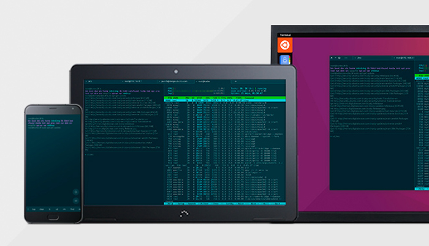

# Terminal application for Ubuntu Touch
[](https://translate.ubports.com/projects/ubports/terminal-app) [](https://github.com/ubports/terminal-app/blob/master/LICENSE.md) [](https://github.com/ubports/terminal-app/issues)


A powerful GNU/Linux terminal emulator, designed for converging on desktop and mobile devices.



## Getting Started

### Branches

- `vivid` (current) is the target for Ubuntu Touch 15.04
- `xenial` is the target for Ubuntu Touch 16.04
- `master` _this branch is currently inactive_

### Installing

Latest stable version of UBports Terminal app is available on [OpenStore](https://open.uappexplorer.com/app/com.ubuntu.terminal). Currently, stable releases are built from the `vivid` branch.

### Building from scratch

We support Clickable as a standardized way to compile Ubuntu Touch application.

One of the main driving factors behind switching over this new tool is the better support cross distro.
It's a unified CLI tool that leverages all the Docker goodies, and allows us to build, test, and install .click applications on Ubuntu Touch and any GNU/Linux distribution.

To build and run terminal-app on your Ubuntu Touch device, ensure Clickable is installed on your machine.

On Ubuntu:

```
  $ sudo apt-add-repository ppa:bhdouglass/clickable
  $ sudo apt update
  $ sudo apt install clickable
  $ clickable setup-docker
```

On other GNU/Linux distros you need to install the Git version. Please refer to the official [Clickable install guide](https://github.com/bhdouglass/clickable/blob/master/README.md) for installing the tool on your system.

Once Clickable is initialized on your system:

```
  $ git clone https://github.com/ubports/terminal-app.git
  $ cd terminal-app
  $ clickable
```

This command will build terminal-app inside an Ubuntu 15.04 Docker container.
It will also create a .click package for Ubuntu Touch, and try to install it on your device if plugged to your PC.

To build and run the application on your desktop machine, run instead:

```
  $ clickable --desktop
```

Your X display will be forwarded into a docker container and the app will run from there.
  
By default, clickable executes the following sub-commands: `kill clean build click-build install launch`

For all the options available, please refer to the [Clickable docs](http://clickable.bhdouglass.com/en/latest/).  
  
## Contributing

Read [CONTRIBUTING.md](/CONTRIBUTING.md) for details on all the processes activated within the project.

All the activities are subject to our [CODE_OF_CONDUCT.md](/CODE_OF_CONDUCT.md).

## Contact & Support

Read [SUPPORT.md](/SUPPORT.md) for details on how to get in touch with us.

## License  
  
This project is available under the terms of the GNU GPL v3.
The full text of the license is available in the [COPYING](/COPYING) file.


## Acknowledgments

`ubports/terminal-app` would not exist without the contributions from several people and communities.

Here is a non-exhaustive list of people and projects that made it possible:

- Filippo Scognamiglio, who originally wrote the application
- The Ubuntu and [UBports translators](https://translate.ubports.com/stats/), for their great contribution
- The KDE community (Konsole), and all the `qtermwidget` developers
- The Ubuntu community

The list of all-time contributors is available on the [GitHub Insights](https://github.com/ubports/terminal-app/graphs/contributors) page. A big thank goes to them as well.
